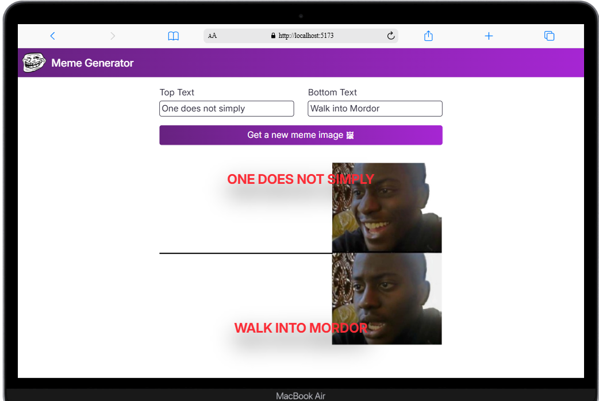

# React Learning Journey – Apprendre React

Bienvenue dans mon parcours d’apprentissage React !

Je suis en train de suivre le cours React de [Learn React](https://scrimba.com/learn-react-c0e) et je code en live chaque jour pour partager mon expérience, mes découvertes, et mes projets.

## Objectifs

- Comprendre les bases de React (JSX, composants, props, state, hooks)
- Construire des projets pratiques et progressifs
- Documenter mon apprentissage jour par jour
- Partager du contenu live pour aider d’autres débutants

## Liens utiles

- [Cours React Scrimba](https://scrimba.com/learn-react-c0e)
- [Ma playlist YouTube complète](https://www.youtube.com/playlist?list=PLCfWsbfoICpvmOSiON2JNlqRpqUNVIFK-)

## Projets

<em> 1. React Facts - Project</em>

  

   

<em> 2. Travel Journal - Project </em>

  

   

<em> 3. Chef Claude - Project </em>

  

  

<em> 4. Meme Generator </em>

  

